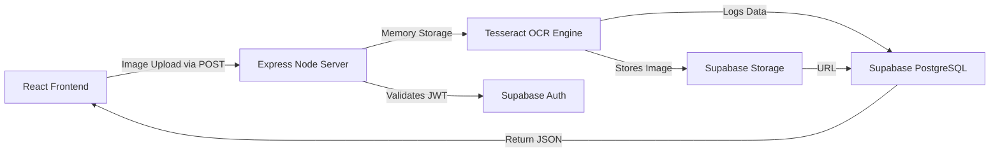

<br>
<p align="center">
  
</p>
<h1 align="center">VisionText — Smart OCR Platform</h1>

<p align="center">
  <strong>A full-stack, AI-powered Optical Character Recognition web application.</strong><br>
  Transform your image-based documents into textual clarity instantly using Tesseract.js and Supabase.
</p>

<p align="center">
  
  
  
  
</p>

---

## ✨ Features

- 🔐 **Premium Split-Panel Authentication:** A sleek, Luminous-inspired login UI with secure JWT access natively powered by Supabase.
- 🗂 **Drag-and-Drop Uploader:** Seamless, in-memory image uploading using Multer. No disk-writes necessary.
- 🧠 **Smart Extraction:** Powered by `Tesseract.js` for highly accurate Optical Character Recognition directly on the server.
- 📜 **Historical Logs:** Automatically saves your extractions to a PostgreSQL database on Supabase so you can access your past text anytime.
- 🖼 **Dynamic Modal Viewer:** Extracted results are presented in a smooth, glassmorphism-inspired Modal popup with one-click clipboard copying. 
- ☁️ **Cloud Native:** Ready-to-deploy setups with CORS dynamic origin parsing specifically tailored for Render (Backend) and Netlify (Frontend).

## 🚀 Architectural Overview

VisionText relies on a fully decoupled architecture:



## 📸 Interface Sneak Peek

### The Professional Dashboard
Your main workspace features a clean sidebar navigation with quick-access text extraction via a seamless upload workflow.
*(Add your screenshot here: ``)*

### History & Archive
Beautifully colored, dynamic cards based on the context of the scanned document format (Legal, Financial, Reports, etc.)
*(Add your screenshot here: ``)*

---

## 🛠 Local Setup Instructions

Want to run VisionText locally? You'll need Node.js and a Supabase Project.

### 1. Supabase Configuration
Create a Supabase project and enable **Authentication** (Email/Password) and create a **Storage Bucket** (e.g., `ocr_bucket`). Create a single table in your SQL Editor:

```sql
CREATE TABLE ocr_history (
    id UUID PRIMARY KEY DEFAULT gen_random_uuid(),
    user_id UUID REFERENCES auth.users(id) ON DELETE CASCADE,
    extracted_text TEXT NOT NULL,
    created_at TIMESTAMP WITH TIME ZONE DEFAULT now()
);
```

### 2. Backend Installation
```bash
cd server
npm install
```
Create a `server/.env` file with you credentials:
```env
PORT=5001
FRONTEND_URL=http://localhost:3000
SUPABASE_URL=https://your-project.supabase.co
SUPABASE_SERVICE_ROLE_KEY=your_secret_role_key
```
Start the backend:
```bash
node index.js
```

### 3. Frontend Installation
```bash
cd client
npm install
```
Create a `client/.env` file:
```env
REACT_APP_SUPABASE_URL=https://your-project.supabase.co
REACT_APP_SUPABASE_ANON_KEY=your_anon_key
REACT_APP_API_URL=http://localhost:5001
```
Start the frontend:
```bash
npm start
```

---

## ☁️ Deployment

VisionText includes automated deployment routing for effortless hosting:
- The **Frontend** can be deployed instantly to Netlify. A `netlify.toml` config handles all frontend routing.
- The **Backend** can be deployed to Render using a Web Service pointed directly at the `server/` directory.

*(Review `DEPLOYMENT_NETLIFY.md` for our customized step-by-step launch guide!)*

---
<p align="center">
  Built with ❤️ for digital creators and data enthusiasts.
</p>
